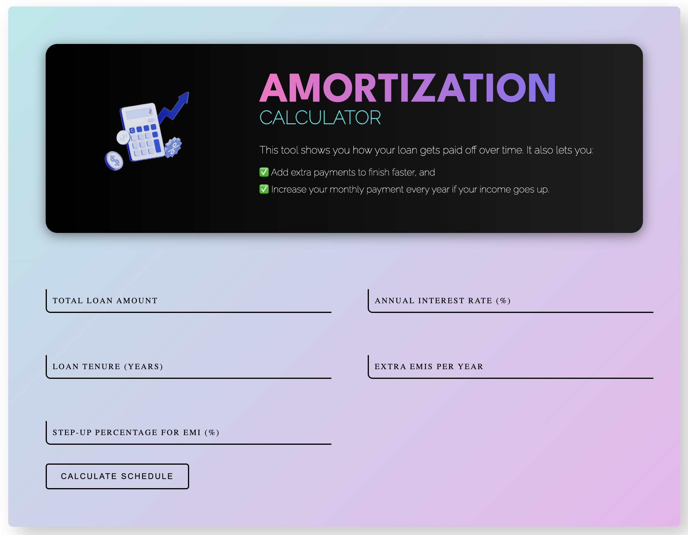
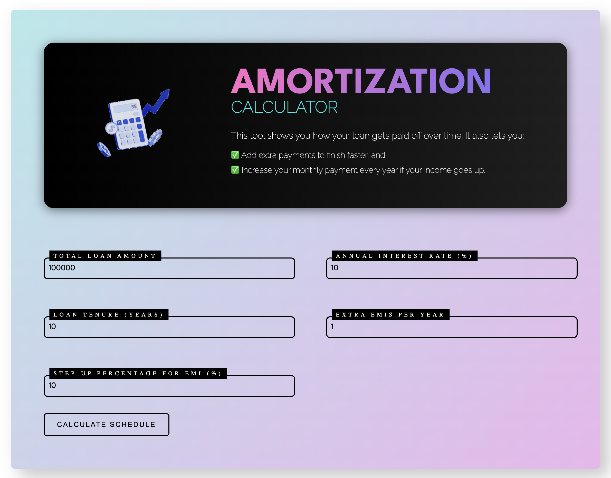
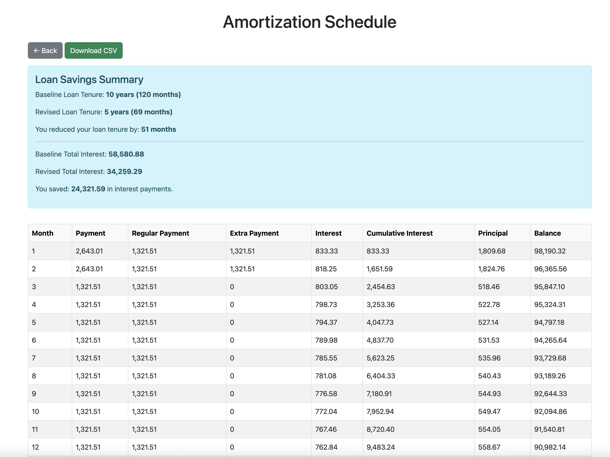

# Loan Amortization Calculator Web Application

A web application that calculates the amortization schedule for a loan, with support for extra EMI payments and annual EMI step-ups. This project displays a detailed monthly breakdown of payments, including regular and extra payments, interest, cumulative interest, principal, and remaining balance. Additionally, it compares the revised schedule against a baseline schedule (without extra payments or step-ups) to highlight the reduction in loan tenure and interest savings.


## Features

- **Amortization Schedule Calculation:**  
  Compute the detailed monthly breakdown for a loan based on:
  - Total loan amount
  - Annual interest rate
  - Loan tenure (years)
  - Extra EMIs per year
  - Step-up percentage for EMI every year

- **Baseline Comparison:**  
  Generates a baseline schedule (without extra payments and step-ups) for comparison, showing:
  - Baseline loan tenure and interest
  - Revised loan tenure and interest
  - Reduction in tenure and interest savings

- **CSV Download:**  
  Download the full amortization schedule as a CSV file.

- **Responsive UI:**  
  A front-end built with Flask and styled using Bootstrap 5, complete with:
  - User-friendly input forms
  - A summary alert highlighting key savings
  - A formatted table with comma-separated numbers and tenure displayed as years and months


## Prerequisites

- Python 3.7 or higher
- pip (Python package installer)


## User Interface

- Landing Page
  

- Inserting Values into the form
  

- Calculating the revised schedule
  


## Installation

1. **Clone the repository:**

   ```bash
   git clone https://github.com/your-username/loan-amortization-calculator.git
   cd loan-amortization-calculator
